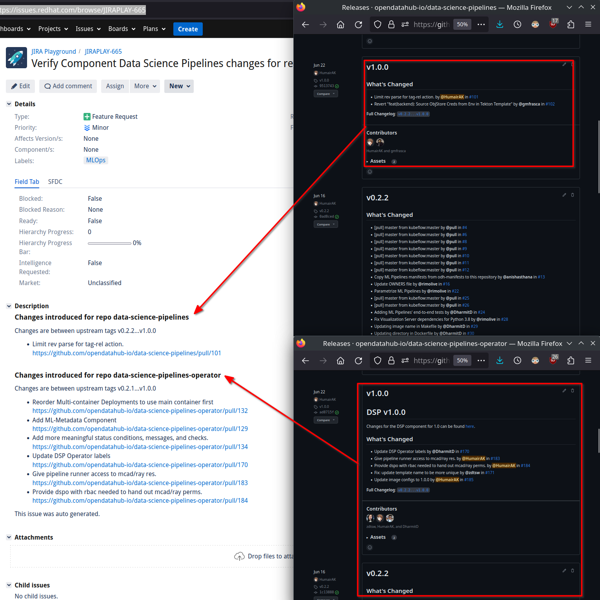
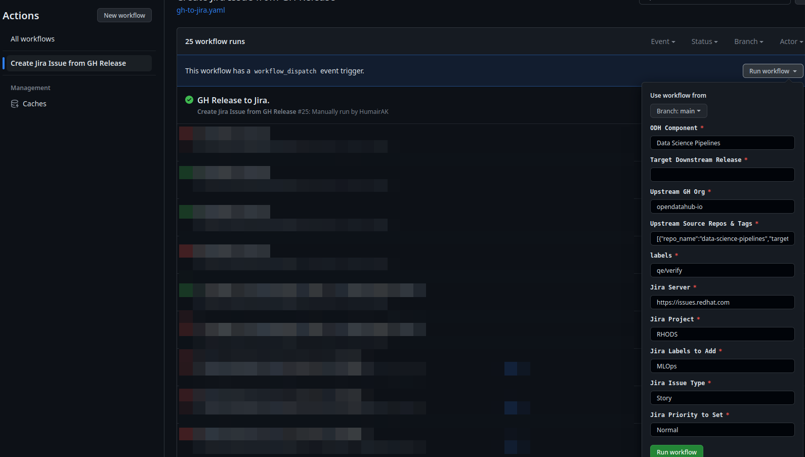

# Send GH Release PRs to Jira

This repo provides a workflow that can be used to forward a set of PRs made within a given range of tags to a Jira board.


## How it works 
This script can be utilized by combining it with a GH workflow which can be found [here](https://github.com/HumairAK/gh-to-jira/blob/main/.github/workflows/gh-to-jira.yaml).

The workflow takes the following inputs: 

* ODH Component (example DSP), this is used in the Jira title
* Target Release for RHODs (e.g. v1.31)
* PR Filter labels 
* Jira info (server, project, jira labels, issue type, priority level)
* Jira/GH Token (should be added as a [GH secret](https://docs.github.com/en/actions/security-guides/encrypted-secrets) `GITHUB_TOKEN`, `JIRA_TOKEN`)
* Source Github Organization
* Source repos and tags in a json example:

```json
[
  {
    "repo_name": "data-science-pipelines",
    "target_release": "v1.0.0",
    "previous_release": "v0.2.2"
  },
  {
    "repo_name": "data-science-pipelines-operator",
    "target_release": "v1.0.0",
    "previous_release": "v0.2.1"
  }
]
```
> Note: convert to a one line json, do this via `jq`, example `cat some.json | jq -c`

This would inform the workflow to collect PRs made for `data-science-pipelines` between tag releases `v0.2.2...v1.0.0`
and for `data-science-pipelines-operator` between tag releases `v0.2.1...v1.0.0`. And add them to a single Jira issue.

An example set of inputs in the GH workflow will look like the following: 

```
component: Data Science Pipelines
target release: v1.31
gh org: opendatahub-io
repos: [{"repo_name":"data-science-pipelines","target_release":"v1.0.0","previous_release":"v0.2.2"},{"repo_name":"data-science-pipelines-operator","target_release":"v1.0.0","previous_release":"v0.2.1"}]
labels: qe/verify
jira server: https://issues.redhat.com
jira project: RHODS
jira labels: MLOps
jira issue type: Story
jira priority: Normal
```

Most of the inputs above should be relatively straight forward, the `labels` field only includes Pull Requests that have
a given GitHub Label.

You can see the releases for the above repos here: 
* [data-science-pipelines-operator](https://github.com/opendatahub-io/data-science-pipelines-operator/releases)
* [data-science-pipelines](https://github.com/opendatahub-io/data-science-pipelines/releases)

The following diagram shows a graphic illustration of the Release Sources and the resulting Jira: 



### Usage: 

The script utilized within the workflow has the following usage.

```bash
usage:  [-h] --component COMPONENT --target_release TARGET_RELEASE --org ORGANIZATION --labels PR_FILTER_LABELS --jira_server JIRA_SERVER --jira_project JIRA_PROJECT --jira_labels JIRA_LABELS --jira_issue_type JIRA_ISSUE_TYPE
        [--jira_priority JIRA_PRIORITY] [--dev] --repos REPOS --gh_token GH_TOKEN --jira_token JIRA_TOKEN

Create a Jira Issue from a GitHub tag release.

options:
  -h, --help            show this help message and exit
  --component COMPONENT
                        ODH Component name, used in Jira title.
  --target_release TARGET_RELEASE
                        Downstream Release target, should match Jira 'Target Release' field.
  --org ORGANIZATION    Upstream GitHub Org
  --labels PR_FILTER_LABELS
                        Upstream labels used to select on the GH issues to include in target Jira issue. Delimited by comma (,).
  --jira_server JIRA_SERVER
                        Jira Server to connect to.
  --jira_project JIRA_PROJECT
                        Jira Project
  --jira_labels JIRA_LABELS
                        Jira Labels to add to the Jira issue. Delimited by comma (,).
  --jira_issue_type JIRA_ISSUE_TYPE
                        Jira Issue Type (E.g. Story, Task, etc.)
  --jira_priority JIRA_PRIORITY
                        Jira Priority, defaults to Normal.
  --dev                 Use this flag to store gh data in cache after first run. This will reduce the number of api calls made to the GH api in consecutive runs.
  --repos REPOS         A JSON of the form [ { repo_name: { previous_release: str, target_release)}, .. ]
  --gh_token GH_TOKEN
  --jira_token JIRA_TOKEN

```

A template GitHub workflow can be found [here](https://github.com/HumairAK/gh-to-jira/blob/main/.github/workflows/gh-to-jira.yaml). 

